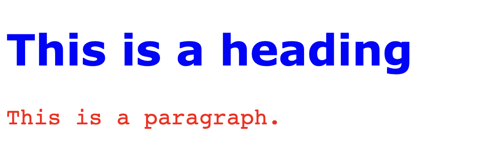

# About this repository

Here we have provided a very simple html file for the purpose of learning HTML. Here style file is also included. 

# HTML Elements and attributes
The HTML element is everything from the start tag to the end tag. HTML attributes provide additional information about HTML elements.
Attributes usually come in name/value pairs like: name="value"

`<tagname> Content goes here...</tagname>`

#### Example:
`<a href="https://www.google.com">Visit Google</a> ` Here `href` is attribute, which specifies the url of the page the link goes to.

## Some basic terminology used
- All HTML documents must start with a document type declaration: `<!DOCTYPE html>`.
- The HTML document itself begins with `<html>` and ends with `</html>`.
    ```
    <html>
        Everything is added here.
    </html>
    ```
- The visible part of the HTML document is between `<body>` and `</body>`.
- So basic structure of a HTML file is
  ```
  <!DOCTYPE html>
    <html>
    <body>
        Everything is added here. Here you can add additional headings, paragraphs etc.
    </body>
    </html>
    ```
## Headings
HTML headings are defined with the `<h1>` to `<h6>` tags. Here `<h1>` defines the most important heading and `<h6>` defines the least important heading. 
The basic structure of the headings are as follows:
```
<h1>Heading </h1>
<h2>Subheading </h2>
<h3>Subsubeading </h3>
```

## Paragraphs
HTML paragraphs are defined with the `<p>` tag and are a paragraph is written in between 
```
<p>
Your paragraph.
</p>
```

## Style 
The HTML style attribute is used to add styles to an element, such as color, font, size, and more by using `<tagname style="property:value;">`.

**Example:**
```
<!DOCTYPE html>
<html>
<body>
<h1 style="color:blue;">This is a heading</h1>
<p>I am normal</p>
<p style="color:red;">I am red</p>  
<p style="color:blue;">I am blue</p>
<p style="font-size:50px;">I am big</p>
</body>
</html>
```
Here, we can change the body color by changing style of body to: `<body style="background-color:#1e90ff;"> Add something..... </body>`

|Style name | explanation | Example |
|-----------|-------------|---------|
|`color`      | for changing the color | for changing paragraph color`<p style="color:blue;">I am blue</p>` |
| `background-color` | for changing background of something | for heading `<h1 style="background-color:powderblue;">This is a heading</h1>` |
| `font-family` | defines the font to be used for an HTML element | `<p style="font-family:courier;">This is a paragraph.</p>` |
| `font-size` | defines the text size for an HTML element | `<p style="font-size:160%;">This is a paragraph.</p>` |
| `text-align`| defines the horizontal text alignment for an HTML element | `<p style="text-align:center;">Centered paragraph.</p>`|
| `border` | setting a border of specific color | `<h1 style="border:2px solid DodgerBlue;">Hello World</h1>`|

## Text Formatting
Formatting elements were designed to display special types of text:
| Formating element | explanation | Example |
|-------------------|-------------|---------|
| `<b>` | Bold text | `<b>This text is bold</b>` |
|`<strong>`| Important text | `<strong>This text is important!</strong>` |
| `<i>` | Italic text | `<i>This text is italic</i>` |
| `<em>` |  Emphasized text  | `<em>This text is emphasized</em>` |
| `<mark>` |  Marked text | `<mark>This text is marked or highlighted </mark>` |
| `<small>` |  Smaller text | `<small>This is some smaller text.</small>` |
| `<del>` |  Deleted text | `<del>text will be strikethrough </del>`|
| `<ins>` |  Inserted text | `<del>blue</del> <ins>red</ins>` blue will be removed and red will be added.|
| `<sub>` |  Subscript text |`x<sub>i</sub> ` is nothing but x_i|
| `<sup>` | Superscript text | `x<sup>2</sup>` is nothing but x^2|

## Links
HTML links are defined with the `<a>` tag and a link is added as: `<a href="url">link text</a>`

```
<a href="https://www.google.com">Write some text about which the link is added</a>
```

The link's destination is specified in the `href` attribute. Attributes are used to provide additional information about HTML elements.

By default, the linked page will be displayed in the current browser window. To change this, you must specify another target for the link. The target attribute specifies where to open the linked document. The target attribute can have one of the following values:

* `_self` - Default. Opens the document in the same window/tab as it was clicked
* `_blank` - Opens the document in a new window or tab
* `_parent` - Opens the document in the parent frame
* `_top` - Opens the document in the full body of the window
    
So to open a link in a new tab, following can be used: `<a href="https://www.google.com/" target="_blank">Visit Google!</a>`. 


## Images
HTML images are defined with the `` tag. The source file (`src`), alternative text (`alt`), `width`, and `height` are provided as attributes:
```

```


# CSS (Cascading Style Sheets)
CSS stands for Cascading Style Sheets. With CSS, you can control the color, font, the size of text, the spacing between elements, how elements are positioned and laid out, what background images or background colors are to be used, different displays for different devices and screen sizes, and much more!

CSS can be added to HTML documents in 3 ways:

1. Inline - by using the `style` attribute inside HTML elements
2. Internal - by using a `<style>` element in the `<head>` section
3. External - by using a `<link>` element to link to an external CSS file


In the current repository, we have used External css style files. Some of the important terminology are as follows:
- **CSS Colors, Fonts and Sizes:** 
    * The CSS `color` property defines the text color to be used. Example: `color: blue;`.
    * The CSS `font-family` property defines the font to be used. Example: `font-family: courier;`.
    * The CSS `font-size` property defines the text size to be used. Example: `font-size: 160%;`.
- **CSS Border:** The CSS border property defines a border around an HTML element. Example: `border: 2px solid powderblue;`.
- **CSS Padding:** The CSS padding property defines a padding (space) between the text and the border. Example: `padding: 30px;`.
- **CSS Margin:** The CSS margin property defines a margin (space) outside the border. Example: `margin: 50px;`.
**Example code:**
```
<!DOCTYPE html>
<html>
<head>
<style>
h1 {
  color: blue;
  font-family: verdana;
  font-size: 300%;
}
p {
  color: red;
  font-family: courier;
  font-size: 160%;
}
</style>
</head>
<body>

<h1>This is a heading</h1>
<p>This is a paragraph.</p>

</body>
</html>
```
**Output of the above code:**




# Reference

For more details, you can follow following reference

1. [For reference follow https://www.w3schools.com/html/](https://www.w3schools.com/html/)
2. [Youtube tutorial video](https://youtube.com/watch?v=RGOj5yH7evk&feature=shares)